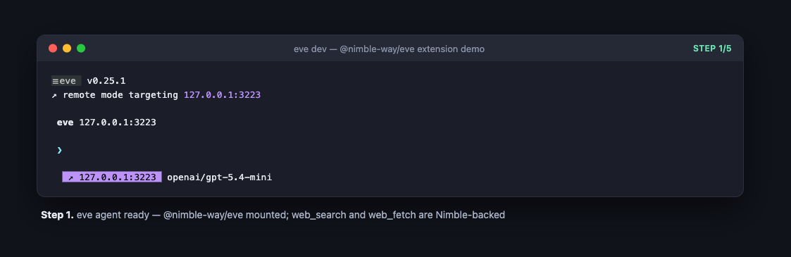
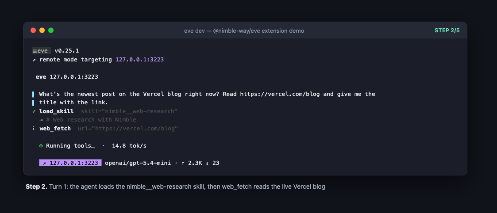
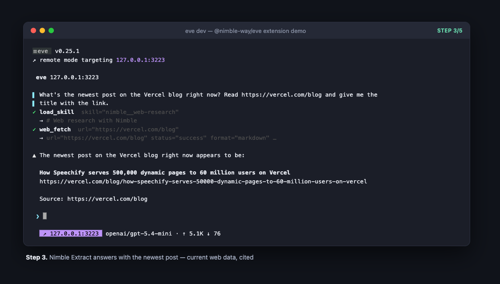
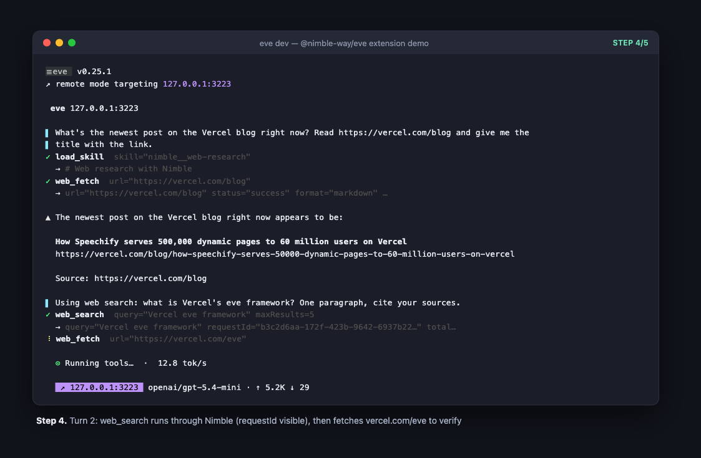
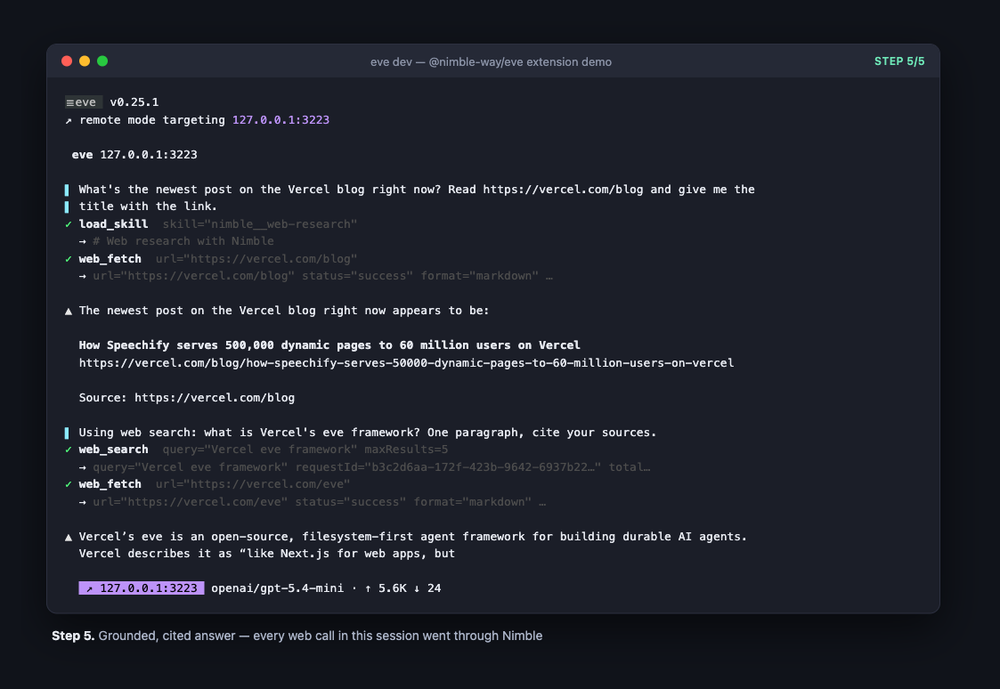

# Demo — `@nimble-way/eve` in a live eve agent

A real, unedited session in eve's terminal UI (`eve dev`), recorded with asciinema and rendered with agg. The agent is a stock `eve init` app with this extension installed from the npm tarball and the [five-file promotion setup](../../README.md#mounting-and-promoting-together-disable-each-duplicate) from the package README (both `web_search` and `web_fetch` promoted to Nimble) — so **every web call below goes through Nimble**.


## What you're seeing

| Step | What happens |
|---|---|
|  | The agent is up. `@nimble-way/eve` is mounted; `web_search` and `web_fetch` resolve to the Nimble implementations (`eve info` lists exactly these two tools plus the `nimble__web-research` skill). |
|  | Turn 1: the model loads the packaged `nimble__web-research` skill, then reads the live Vercel blog with `web_fetch` — Nimble Extract underneath (`status="success" format="markdown"`). |
|  | It answers with the blog's newest post — current web data, with the link. |
|  | Turn 2: `web_search` runs through Nimble Search, then the agent verifies by fetching `vercel.com/eve`. |
|  | A grounded, cited answer. Two turns, four tool calls, all Nimble. |

## Reproduce it

```bash
npx eve@latest init my-agent && cd my-agent
npm i @nimble-way/eve
```

Add the five-file promotion setup from the [package README](../../README.md#mounting-and-promoting-together-disable-each-duplicate) — the directory mount, the `web_search` and `web_fetch` promotions, and the two matching `disableTool()` files for the namespaced duplicates — put `NIMBLE_API_KEY` in `.env.local`, and run:

```bash
npx eve dev
```

Recorded against `eve@0.25.1`, model `openai/gpt-5.4-mini` (works with any tool-calling model — the overrides make web search model-provider-independent).
